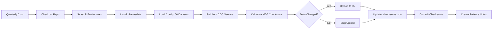

# NHANES Data Automation - Implementation Guide

## 🎉 Implementation Complete!

This document summarizes the automated NHANES data pipeline implementation with all requested features.

## 📦 Core Features Implemented

### 1. **GitHub Actions Workflow** (`.github/workflows/update-nhanes-data.yml`)
- ✅ Quarterly automated runs (Jan 1, Apr 1, Jul 1, Oct 1 at 2 AM UTC)
- ✅ Manual trigger support with options for:
  - Specific dataset selection
  - Dry-run mode (testing without R2 upload)
- ✅ Secure credential handling via GitHub Secrets
- ✅ Automatic checksum updates committed to repo
- ✅ Workflow summary artifacts and release notes

### 2. **Change Detection System** (`R/data.R`)
- ✅ `detect_data_changes()` - MD5 checksum comparison
- ✅ `update_checksum()` - Update hash tracking file
- ✅ `load_dataset_config()` - Read YAML configuration
- ✅ `.checksums.json` - Git-tracked version control

### 3. **Dataset Configuration** (`inst/extdata/datasets.yml`)
- ✅ All **66 NHANES datasets** catalogued
- ✅ Organized by category (questionnaire/examination)
- ✅ Includes descriptions and special notes
- ✅ Easily extensible for future datasets

### 4. **Workflow Orchestration** (`inst/scripts/workflow_update.R`)
- ✅ Pulls data from CDC servers
- ✅ Detects changes via checksums
- ✅ Uploads only modified datasets to R2
- ✅ Generates JSON summary report
- ✅ Supports dry-run and dataset filtering

### 5. **Security Documentation** (`SECURITY.md`)
- ✅ Step-by-step R2 API token creation
- ✅ GitHub Secrets configuration guide
- ✅ Security best practices
- ✅ Token rotation schedule
- ✅ Incident response procedures

### 6. **Enhanced README**
- ✅ Clear explanation of CDC cycle suffixes vs base names
- ✅ Tidyverse-style code examples (`purrr::map()`)
- ✅ Automated pipeline documentation
- ✅ Manual trigger instructions
- ✅ All 66 datasets listed
- ✅ Usage examples for common workflows

### 7. **Bug Fixes**
- ✅ Implemented missing `drop_label_kyle()` function
- ✅ Added proper roxygen2 documentation
- ✅ Updated NAMESPACE exports

### 8. **Updated Dependencies** (`DESCRIPTION`)
- ✅ Added `jsonlite` for checksum storage
- ✅ Added `yaml` for config parsing
- ✅ Added `tibble` for data structures
- ✅ Added `purrr` to Suggests for README examples

---

## 🔐 Next Steps (Manual Actions Required)

You'll need to complete these steps to activate the automation:

### 1. Create Cloudflare R2 API Token

1. Log in to [Cloudflare Dashboard](https://dash.cloudflare.com/)
2. Navigate to **R2** → **Manage R2 API Tokens**
3. Click **Create API Token**
4. Configure:
   - **Name:** `nhanes-data-workflow`
   - **Permissions:** Object Read & Write
   - **Bucket scope:** `nhanes-data` (specific bucket only)
   - **TTL:** 1 year (set reminder to rotate)
5. **CRITICAL:** Copy these values immediately (shown only once!):
   - Access Key ID
   - Secret Access Key
   - Account ID (also in dashboard URL)

### 2. Add GitHub Secrets

1. Go to your GitHub repository: `https://github.com/kyleGrealis/nhanesdata`
2. Navigate to **Settings** → **Secrets and variables** → **Actions**
3. Click **New repository secret** and add each:

| Secret Name | Value | Source |
|------------|-------|--------|
| `R2_ACCOUNT_ID` | Your Cloudflare Account ID | Dashboard URL or R2 settings |
| `R2_ACCESS_KEY_ID` | Access Key ID from Step 1 | API token creation |
| `R2_SECRET_ACCESS_KEY` | Secret Access Key from Step 1 | API token creation |

### 3. Enable GitHub Actions Permissions

1. Go to **Settings** → **Actions** → **General**
2. Under **Workflow permissions**, select:
   - ✅ "Read and write permissions"
   - ✅ "Allow GitHub Actions to create and approve pull requests"
3. Click **Save**

### 4. Test the Workflow

**Option A: Via GitHub UI**
1. Go to **Actions** tab
2. Select **Update NHANES Data** workflow
3. Click **Run workflow**
4. Set options:
   - Datasets: `demo` (single dataset for testing)
   - Dry run: ✅ (check the box)
5. Click **Run workflow**
6. Wait for completion and check the **workflow_summary.json** artifact

**Option B: Via GitHub CLI**
```bash
# Test with dry run (no R2 upload)
gh workflow run update-nhanes-data.yml -f dry_run=true -f datasets="demo"

# Check workflow status
gh run list --workflow=update-nhanes-data.yml

# View workflow logs
gh run view --log
```

### 5. Production Run (Optional)

Once the dry run succeeds, test a real upload:

```bash
# Upload single dataset to R2
gh workflow run update-nhanes-data.yml -f datasets="demo"

# Check that demo.parquet appears at https://nhanes.kylegrealis.com/demo.parquet
```

---

## 📁 Files Created/Modified

### New Files Created

```
.github/workflows/
└── update-nhanes-data.yml          # GitHub Actions workflow

inst/extdata/
└── datasets.yml                     # 66 dataset configuration

inst/scripts/
└── workflow_update.R                # Orchestration script

man/
├── detect_data_changes.Rd           # Function documentation
├── update_checksum.Rd               # Function documentation
└── load_dataset_config.Rd           # Function documentation

SECURITY.md                          # R2 setup & security guide
IMPLEMENTATION_GUIDE.md              # This file
.checksums.json                      # MD5 hash tracking (git-tracked)
```

### Modified Files

```
R/
├── data.R                           # Added 3 new functions
└── custom_functions.R               # Implemented drop_label_kyle()

DESCRIPTION                          # Added dependencies
NAMESPACE                            # Updated exports
README.md                            # Complete rewrite
man/drop_label_kyle.Rd               # Fixed documentation
```

---

## 🎯 How It Works

### Automated Quarterly Pipeline



### Step-by-Step Process

1. **GitHub Actions Trigger**
   - Cron: `0 2 1 1,4,7,10 *` (quarterly)
   - Manual: `workflow_dispatch` event

2. **Environment Setup**
   - Ubuntu runner
   - R release version
   - Install package dependencies

3. **Data Acquisition**
   - Load `inst/extdata/datasets.yml`
   - For each dataset:
     - Call `pull_nhanes(dataset_name)`
     - Merges all CDC cycles (e.g., DEMO, DEMO_B, ..., DEMO_L)
     - Saves to `data/raw/parquet/demo.parquet`

4. **Change Detection**
   - Calculate MD5 hash of parquet file
   - Compare with `.checksums.json`
   - Log: NEW, CHANGED, or UNCHANGED

5. **R2 Upload (if changed)**
   - Call `nhanes_pin_write(data, name, bucket='nhanes-data')`
   - Uses S3-compatible API with pins package
   - Versioned storage on Cloudflare R2

6. **Checksum Update**
   - Update `.checksums.json` with new hash
   - Commit to git with automated message

7. **Summary Report**
   - Generate `workflow_summary.json`
   - Upload as GitHub artifact (90-day retention)
   - Create release notes artifact

---

## 🔒 Security Model

### Public Read / Private Write Architecture

This implements the industry-standard security model used by CRAN, Bioconductor, and AWS Open Data Registry.

**Tier 1: Public Data Access (Users)**
- **Method:** HTTPS GET to `https://nhanes.kylegrealis.com/`
- **Authentication:** None required
- **Operations:** Read-only downloads
- **Rate Limiting:** Cloudflare CDN handles DDoS protection
- **Justification:** NHANES is public health data (U.S. government)

**Tier 2: Data Upload (Workflow Only)**
- **Method:** S3-compatible API with scoped credentials
- **Authentication:** R2 API token (GitHub Secrets)
- **Operations:** Write, update, delete
- **Scope:** Limited to `nhanes-data` bucket only
- **Permissions:** No account-level or billing access

### Why This Is Secure

✅ **Scoped Token**: Can only write to one bucket (no account access)
✅ **Principle of Least Privilege**: Minimal permissions granted
✅ **GitHub Secrets**: Credentials encrypted at rest
✅ **Audit Trail**: Cloudflare logs all API operations
✅ **Version Control**: `.checksums.json` tracks all changes
✅ **Workflow Isolation**: Each run is stateless and sandboxed

### Token Rotation Schedule

- **Frequency:** Annually (set calendar reminder)
- **Process:**
  1. Create new R2 API token with same scope
  2. Update GitHub Secrets
  3. Test with dry run
  4. Revoke old token in Cloudflare dashboard

---

## 📊 Dataset Organization

### CDC Naming Convention

CDC releases NHANES data in 2-year cycles with letter suffixes:

| Cycle | Years | Suffix | Example (Demographics) |
|-------|-------|--------|----------------------|
| 1 | 1999-2000 | (none) | `DEMO` |
| 2 | 2001-2002 | B | `DEMO_B` |
| 3 | 2003-2004 | C | `DEMO_C` |
| 4 | 2005-2006 | D | `DEMO_D` |
| 5 | 2007-2008 | E | `DEMO_E` |
| 6 | 2009-2010 | F | `DEMO_F` |
| 7 | 2011-2012 | G | `DEMO_G` |
| 8 | 2013-2014 | H | `DEMO_H` |
| 9 | 2015-2016 | I | `DEMO_I` |
| 10 | 2017-2018 | J | `DEMO_J` |
| (skipped) | 2019-2020 | K | Not released (COVID-19) |
| 11 | 2021-2022 | L | `DEMO_L` |

**Note:** Letter K is skipped because the 2019-2020 cycle was interrupted by the COVID-19 pandemic.

### Our Storage Format

We combine all cycles and store by **base name only**:

```
CDC Server:          Our R2 Bucket:
-----------          --------------
DEMO                 demo.parquet (all cycles merged)
DEMO_B
DEMO_C
...
DEMO_L

BPX                  bpx.parquet (all cycles merged)
BPX_B
BPX_C
...
BPX_L
```

Each merged dataset includes a `year` column to track cycle origin.

### All 66 Datasets

See `inst/extdata/datasets.yml` for the complete list organized by:
- **Questionnaire/Interview Tables (50 datasets)**
- **Examination Tables (16 datasets)**

---

## 🚀 Usage After Deployment

### For End Users

```r
# Install package
remotes::install_github("kyleGrealis/nhanesdata")

# Load pre-processed data (no CDC download needed)
library(nhanesdata)
demo <- read_nhanes('demo')
bpx <- read_nhanes('bpx')

# Load multiple datasets with tidyverse style
c('demo', 'bpx', 'bmx', 'trigly') |>
  purrr::map(read_nhanes) |>
  purrr::set_names(c('demo', 'bpx', 'bmx', 'trigly'))
```

### For Maintainers

```bash
# Manual workflow trigger (all datasets)
gh workflow run update-nhanes-data.yml

# Update specific datasets only
gh workflow run update-nhanes-data.yml -f datasets="demo,bpx,trigly"

# Dry run (testing without R2 upload)
gh workflow run update-nhanes-data.yml -f dry_run=true

# Check workflow status
gh run list --workflow=update-nhanes-data.yml

# View latest run logs
gh run view --log
```

---

## 🐛 Troubleshooting

### Workflow Fails During Data Pull

**Symptom:** Dataset download times out or fails

**Cause:** CDC servers are unreliable (common issue)

**Solution:**
```bash
# Re-run the workflow (CDC servers may recover)
gh run rerun <run-id>

# Or manually trigger for failed datasets only
gh workflow run update-nhanes-data.yml -f datasets="failed_dataset1,failed_dataset2"
```

### R2 Upload Permission Denied

**Symptom:** Error during `nhanes_pin_write()`

**Cause:** GitHub Secrets not set or R2 token expired

**Solution:**
1. Verify secrets exist: Settings → Secrets and variables → Actions
2. Check token expiration in Cloudflare dashboard
3. Rotate token if needed (see SECURITY.md)

### Checksum Commit Fails

**Symptom:** Git push rejected in workflow

**Cause:** Branch protection rules blocking bot commits

**Solution:**
1. Settings → Branches → Edit branch protection for `main`
2. Under "Restrict who can push to matching branches", add `github-actions[bot]`
3. Or temporarily disable branch protection for automated commits

---

## 📈 Monitoring & Maintenance

### Quarterly Review Checklist

After each quarterly run:

- [ ] Check workflow summary artifact
- [ ] Verify changed datasets uploaded to R2
- [ ] Test public access: `https://nhanes.kylegrealis.com/demo.parquet`
- [ ] Review `.checksums.json` commit
- [ ] Check R2 storage usage (Cloudflare dashboard)
- [ ] Confirm no failed datasets

### Annual Maintenance

- [ ] Rotate R2 API token
- [ ] Review and update `inst/extdata/datasets.yml` (new CDC datasets?)
- [ ] Check for package dependency updates
- [ ] Review R2 storage costs
- [ ] Update SECURITY.md if procedures change

---

## 🎓 Learning Resources

### NHANES Data
- [CDC NHANES Website](https://www.cdc.gov/nchs/nhanes/)
- [NHANES Tutorials](https://wwwn.cdc.gov/nchs/nhanes/tutorials/default.aspx)
- [nhanesA Package Documentation](https://cran.r-project.org/package=nhanesA)

### GitHub Actions
- [Workflow Syntax](https://docs.github.com/en/actions/using-workflows/workflow-syntax-for-github-actions)
- [Encrypted Secrets](https://docs.github.com/en/actions/security-guides/encrypted-secrets)
- [GitHub CLI](https://cli.github.com/manual/gh_workflow)

### Cloudflare R2
- [R2 Documentation](https://developers.cloudflare.com/r2/)
- [R2 API Tokens](https://developers.cloudflare.com/r2/api/s3/tokens/)
- [S3 API Compatibility](https://developers.cloudflare.com/r2/api/s3/api/)

---

## 📝 License & Attribution

- **NHANES Data:** Public domain (U.S. government)
- **Package Code:** MIT License
- **Automation:** Implemented 2025-01-16

For questions or issues, open a GitHub Issue at:
`https://github.com/kyleGrealis/nhanesdata/issues`

---

**Last Updated:** 2025-01-16
**Next Review:** After first quarterly run (2025-04-01)
