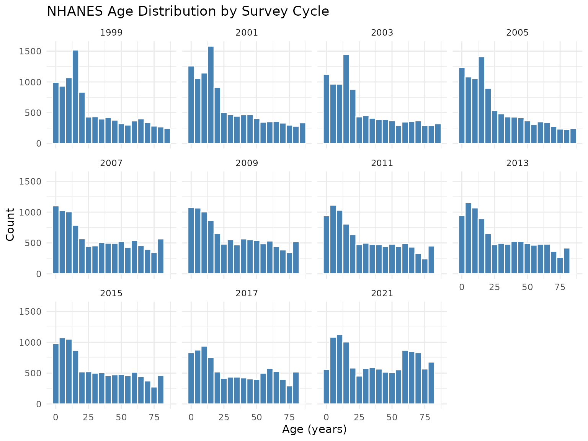
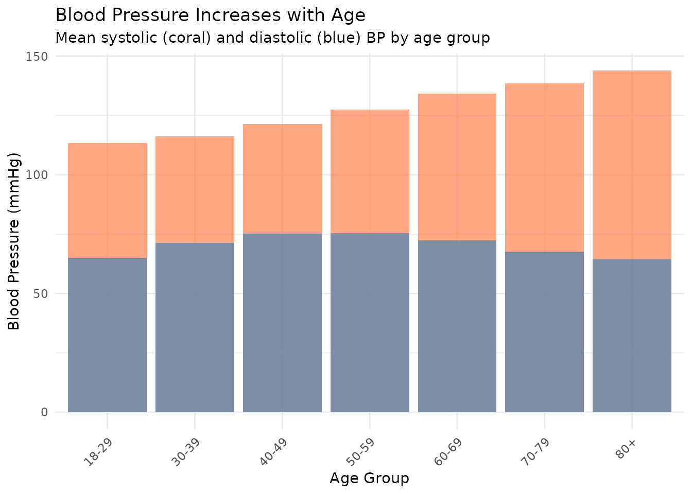

# Getting Started with NHANES Data

## Motivation

The National Health and Nutrition Examination Survey (NHANES) is one of
the most widely used public health datasets in the U.S., spanning over
two decades of continuous data collection. Working with NHANES data
directly from the CDC presents two recurring problems:

1.  **Server reliability.** The CDC’s data servers are frequently slow
    or unresponsive, which breaks reproducible workflows.
2.  **Cycle management.** The CDC publishes data in two-year cycles with
    letter suffixes (`DEMO`, `DEMO_B`, …, `DEMO_L`). Combining cycles
    requires tracking naming conventions and reconciling type
    differences across waves.

**nhanesdata** addresses both issues by hosting pre-merged,
type-harmonized datasets on Cloudflare R2 with public access. A single
call to `read_nhanes("demo")` returns all demographics data from
1999-2023 with a `year` column identifying each survey cycle.

## Acknowledgments

This package builds on the
[**nhanesA**](https://cran.r-project.org/package=nhanesA) package, which
provides the underlying interface to NHANES data in R.

## Installation

``` r
# install.packages("pak")
pak::pak("kyleGrealis/nhanesdata")
```

``` r
library(nhanesdata)
library(dplyr)
library(ggplot2)
```

## Loading Data

    #> Loading: DEMO
    #> DEMO complete! (113,249 rows)

``` r
demo <- read_nhanes("demo")
glimpse(demo)
```

Every dataset includes two key columns:

- `year`: Survey cycle start year (1999, 2001, 2003, …, 2017, 2021)
- `seqn`: Respondent sequence number (unique within a cycle, used for
  joining)

Dataset names are case-insensitive: `"demo"`, `"DEMO"`, and `"Demo"` all
work.

## Example: Age Distribution Over Time

``` r
demo |>
  filter(!is.na(ridageyr)) |>
  ggplot(aes(x = ridageyr)) +
  geom_histogram(binwidth = 5, fill = "steelblue", color = "white") +
  facet_wrap(~year, ncol = 4) +
  labs(
    title = "NHANES Age Distribution by Survey Cycle",
    x = "Age (years)",
    y = "Count"
  ) +
  theme_minimal()
```



## CDC Dataset Naming

When you call `read_nhanes("demo")`, you receive data that the CDC
publishes across multiple cycle-specific tables:

| CDC Table | Survey Years | Package Behavior                    |
|-----------|--------------|-------------------------------------|
| DEMO      | 1999-2000    | Merged into a single `demo` dataset |
| DEMO_B    | 2001-2002    | with a `year` column and            |
| DEMO_C    | 2003-2004    | harmonized data types               |
| …         | …            | across all cycles.                  |
| DEMO_L    | 2021-2023    |                                     |

This matters when you need CDC documentation for a specific variable.
Use
[`get_url()`](https://www.kylegrealis.com/nhanesdata/reference/get_url.md)
to retrieve the codebook URL for any cycle-specific table:

``` r
get_url("DEMO")   # 1999-2000 codebook
get_url("DEMO_I") # 2015-2016 codebook
```

The 2019-2020 cycle (suffix K) is excluded from all datasets. See
[`vignette("covid-data-exclusion")`](https://www.kylegrealis.com/nhanesdata/articles/covid-data-exclusion.md)
for details.

## Joining Multiple Datasets

Combine datasets using `seqn` and `year` as join keys:

``` r
demo <- read_nhanes("demo")
bpx <- read_nhanes("bpx")
bmx <- read_nhanes("bmx")

analysis_data <- demo |>
  inner_join(bpx, by = c("seqn", "year")) |>
  inner_join(bmx, by = c("seqn", "year")) |>
  select(year, seqn, ridageyr, riagendr, bpxsy1, bmxbmi)
```

Always join on **both** `seqn` and `year`. Each `seqn` is unique within
its cycle, and joining on both columns ensures participants are matched
within the same survey period.

## Filtering by Survey Year

``` r
demo <- read_nhanes("demo")

# Recent cycles only
recent <- demo |>
  filter(year >= 2015)

# Compare time periods
demo |>
  mutate(
    period = case_when(
      year < 2010 ~ "1999-2009",
      year < 2020 ~ "2010-2019",
      TRUE ~ "2020+"
    )
  ) |>
  group_by(period) |>
  summarise(n = n())
```

## Finding Variables

### By keyword

``` r
term_search("blood pressure")
```

Returns variable names, table names, descriptions, and collection years.
From there you can identify the base table name (e.g., `BPX`) for use
with
[`read_nhanes()`](https://www.kylegrealis.com/nhanesdata/reference/read_nhanes.md).

### By variable name

``` r
var_search("BPXSY1")
```

Shows which cycles contain a specific variable.

### In loaded data

    #> Loading: BMX
    #> BMX complete! (105,626 rows)

``` r
"bmxht" %in% names(bmx)
#> [1] TRUE
```

All search functions are case-insensitive.

## Complete Example: Blood Pressure by Age Group

``` r
demo <- read_nhanes("demo")
bpx <- read_nhanes("bpx")

bp_analysis <- demo |>
  filter(ridageyr >= 18) |>
  select(seqn, year, ridageyr, riagendr, ridreth1) |>
  inner_join(
    bpx |> select(seqn, year, bpxsy1, bpxdi1),
    by = c("seqn", "year")
  ) |>
  filter(!is.na(bpxsy1), !is.na(bpxdi1), bpxsy1 > 0, bpxdi1 > 0) |>
  mutate(
    age_group = cut(
      ridageyr,
      breaks = c(18, 30, 40, 50, 60, 70, 80, Inf),
      labels = c(
        "18-29", "30-39", "40-49", "50-59",
        "60-69", "70-79", "80+"
      ),
      right = FALSE
    )
  )

bp_summary <- bp_analysis |>
  group_by(age_group) |>
  summarize(
    n = n(),
    mean_systolic = mean(bpxsy1),
    mean_diastolic = mean(bpxdi1),
    .groups = "drop"
  )
```

``` r
bp_summary |>
  ggplot(aes(x = age_group)) +
  geom_col(aes(y = mean_systolic), fill = "coral", alpha = 0.7) +
  geom_col(aes(y = mean_diastolic), fill = "steelblue", alpha = 0.7) +
  labs(
    title = "Blood Pressure Increases with Age",
    subtitle = "Mean systolic (coral) and diastolic (blue) BP by age group",
    x = "Age Group",
    y = "Blood Pressure (mmHg)"
  ) +
  theme_minimal() +
  theme(axis.text.x = element_text(angle = 45, hjust = 1))
```



## Next Steps

- Browse the [dataset
  catalog](https://www.kylegrealis.com/nhanesdata/articles/the-datasets.md)
  for the full list of available tables
- Learn about [creating survey design
  objects](https://www.kylegrealis.com/nhanesdata/articles/survey-design.md)
  with proper weighting for multi-cycle analyses
- Read about the [2019-2020 cycle
  exclusion](https://www.kylegrealis.com/nhanesdata/articles/covid-data-exclusion.md)
- Use
  [`?read_nhanes`](https://www.kylegrealis.com/nhanesdata/reference/read_nhanes.md)
  for function documentation
- File issues or feature requests on
  [GitHub](https://github.com/kyleGrealis/nhanesdata/issues)
